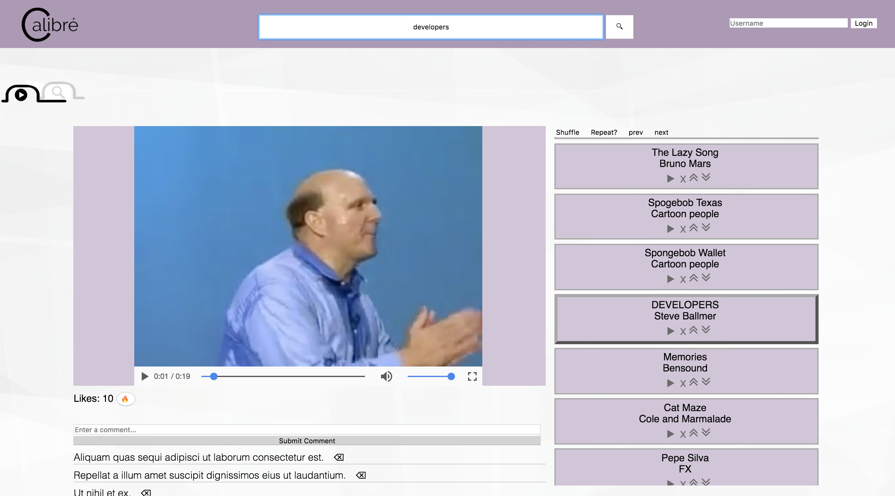
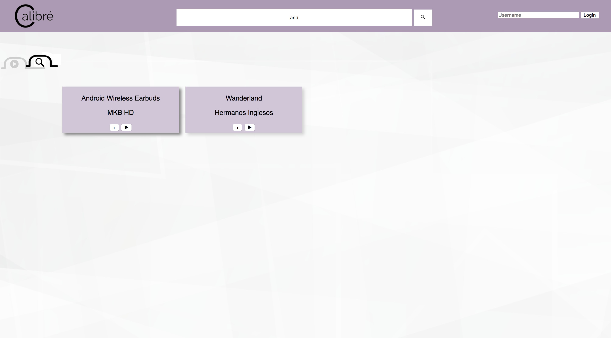

# Calibre
Calibre is a web application that allows users to search, play, and save music and videos to a playlist.

[Click here to view the frontend of Calibre](https://github.com/MarvinClerge/Calibre)

## Motivation
The goal behind this application was to refine my web development skills in the following areas:
* Create a single page application using vanilla javascript
* Mimic and learn React.js and Redux structure using my own state and store
* Create and query an Rails API backend using a PostgreSQL database.
* Write custom CSS and become familiar with grid and flexbox
* Working with a group of three and learning git
* Understanding HTML video and audio tags

## Tech/framework used
#### PostgreSQL
Used to store and manage user information.
#### Ruby on Rails
Used to create a backend JSON API that allow users to save their playlists and allow authentication.

## Installation
In order to use this application ruby and the ruby gem must be installed
### MAC OS
1. Download both the frontend and backend of Calibre
2. Go to the backend folder location in your terminal and run bundle install
3. After the installation is complete run rails db:migrate and rails db:seed to create the database
4. Run rails s to start the backend rails server
5. Go to the frontend folder location in your terminal
6. Open index.html in your browser

## How to use?
After completing the installation. You can now use the site. Here are the myriad of things you can do starting with the navbar.

#### Searching
In the center of the navbar you will see a large search bar. If you type in and click the search icon or press enter you will be taken to a new page containing your search results.
#### Login
In the top right if the navbar you will find the login input. This site only needs a username to login. After typing in your username if you have made a playlist previously it will be loaded. If not then your modifications to your playlist will now be saved
#### Switching Sections
Under the navbar there will be two tab buttons that allow you to switch between the playing and the browsing section.
#### Playlist
In the right side of the playing section you can manage your playlist. In the upper section of the playlist you can shuffle, repeat, play previous, and play next songs. In the list of songs you can play, remove, and change the song’s order.
#### Likes & Comments
Under the video player you will find the likes and comments section. Here if you are logged in you can like a video by clicking the fire button, and comment by typing in the comment box and submitting.
#### Browsing and Suggestions
At the bottom of the playing section and in the browsing sections there will be a variety of blocks for videos and music. Clicking on the play button will take you to the playing section and start the media. If you click the add button it will be added to your playlist. If you have added the video or song to your playlist you will not be able to add it again.

## Screenshots

## License
MIT License

Copyright (c) 2018 Marvin Clerge

Permission is hereby granted, free of charge, to any person obtaining a copy
of this software and associated documentation files (the "Software"), to deal
in the Software without restriction, including without limitation the rights
to use, copy, modify, merge, publish, distribute, sublicense, and/or sell
copies of the Software, and to permit persons to whom the Software is
furnished to do so, subject to the following conditions:

The above copyright notice and this permission notice shall be included in all
copies or substantial portions of the Software.

THE SOFTWARE IS PROVIDED "AS IS", WITHOUT WARRANTY OF ANY KIND, EXPRESS OR
IMPLIED, INCLUDING BUT NOT LIMITED TO THE WARRANTIES OF MERCHANTABILITY,
FITNESS FOR A PARTICULAR PURPOSE AND NONINFRINGEMENT. IN NO EVENT SHALL THE
AUTHORS OR COPYRIGHT HOLDERS BE LIABLE FOR ANY CLAIM, DAMAGES OR OTHER
LIABILITY, WHETHER IN AN ACTION OF CONTRACT, TORT OR OTHERWISE, ARISING FROM,
OUT OF OR IN CONNECTION WITH THE SOFTWARE OR THE USE OR OTHER DEALINGS IN THE
SOFTWARE.
